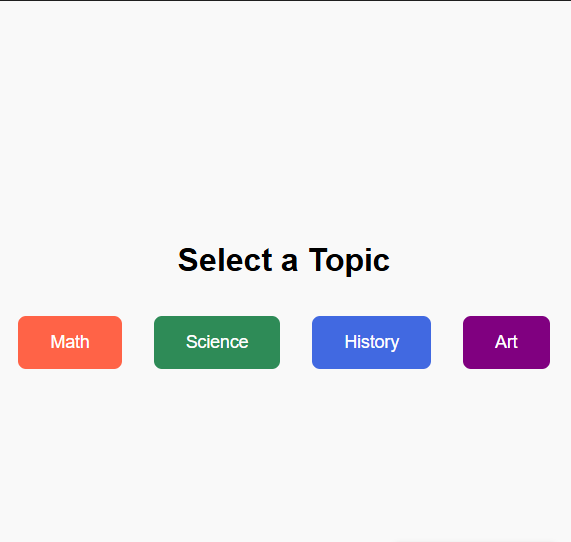

# 🎴 Flashcard Game

A browser-based interactive flashcard game to help you study **Math, Science, History, and Art** across multiple difficulty levels.

---

## 📚 Features

- 🔢 **4 Topics**: Math, Science, History, Art  
- 🎚️ **3 Difficulty Levels**: Easy, Medium, Hard  
- ❓ **5 Questions per level** — 60 total  
- 🧠 **Flashcards with rotating animation**  
- ✏️ Type your answer and reveal the correct one  
- ✅ Choose "Correct" or ❌ "Incorrect"  
- 📊 View your performance report after each round  
- 🎨 Colorful result boxes for clarity and motivation  

---

## 🚀 How to Run

1. **Clone or download** this repository  
2. Open the `index.html` file in any web browser  
3. No setup required — fully offline and standalone!

---

## 📁 File Structure

flashcard-game/ 
├── index.html # Main HTML structure 
├── style.css # Styling and animations 
└── script.js # Game logic and questions 

---

## 🏅 Scoring System

After completing 5 questions, you'll see:

- ✅ Correct answers count
- ❌ Incorrect answers count
- 🏆 Grade: A+, A, B+, etc.
- 💬 Feedback: Good / Normal / Bad

All results are color-coded for better experience.

---

## 💡 Customization

- Add your own questions in `script.js` inside the `fullQuestions` object.
- Modify colors and layout via `style.css`.
- Add sound effects, time limits, or progress bars to extend it!

---

## 🛠 Built With

- **HTML** – Structure  
- **CSS** – Style and card animations  
- **JavaScript** – Flashcard logic and data handling

---

## 📸 Preview

 <!-- Optional: Add your screenshot file here -->

---

## 📄 License

This project is open for educational and non-commercial use. No warranty included.  
Feel free to remix, improve, or contribute!

---

